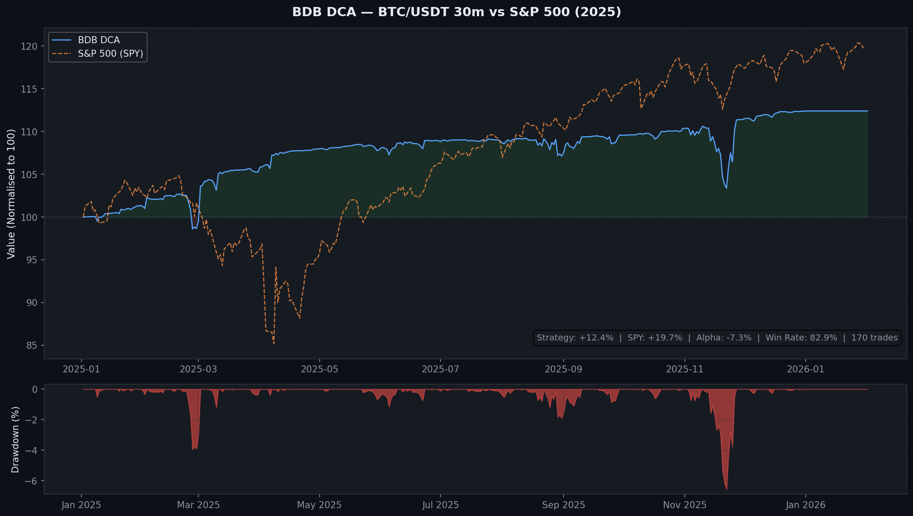

# BDB DCA — BTC/USDT 30m

Layered DCA (dollar-cost averaging) entry system for BTC/USDT on the 30-minute timeframe. Entries trigger only on high-probability mean-reversion setups confirmed by the Williams Alligator indicator.

## Performance



### Backtest Results (2025, BTC/USDT 30m)

| Metric | Value |
|--------|-------|
| Net Profit | +$1,240 / +12.4% |
| Final Equity | $11,240 from $10,000 |
| Win Rate | 82.9% (141W / 29L) |
| Total Trades | 170 |
| Profit Factor | 2.54 |
| Max Drawdown | $940 / −9.4% |
| Avg Trade PnL | +$7.30 |
| vs SPY | −7.3% alpha (SPY +19.7%) |

> The high win rate (82.9%) is structurally inflated by the DCA layering — averaging down converts losing positions into eventual winners. The real risk is a black-swan move that triggers all 4 DCA layers simultaneously.

## How It Works

### 1. Entry Signal — Bullish Divergent Bar

All three conditions must be true on the same candle:

```
1. close > (high + low) / 2        — bar closes in upper half
2. low == lowest(low, 7)           — local low within 7-bar window
3. high < Jaw AND high < Teeth     — entire bar below Williams Alligator
   AND high < Lips
```

### 2. Williams Alligator

Three smoothed moving averages that define trend:

| Line | Period | Shift |
|------|--------|-------|
| Jaw (blue) | 13-bar SMMA of hl2 | shifted 8 bars forward |
| Teeth (red) | 8-bar SMMA of hl2 | shifted 5 bars forward |
| Lips (green) | 5-bar SMMA of hl2 | shifted 3 bars forward |

When the bar is below all three lines, price is in a "sleeping" Alligator zone — a high-probability reversal area.

### 3. DCA Layers

If price continues lower after the initial entry, additional layers are added:

| Layer | Trigger | Size |
|-------|---------|------|
| 1 | Signal bar high break | 1× base |
| 2 | −4% from Layer 1 | 2× base |
| 3 | −10% from Layer 1 | 2× base |
| 4 | −22% from Layer 1 | 2× base |

### 4. Exit

Take-profit: `entry_price + ATR(14) × 2.0`
Trailing stop: ATR × 2.0 from highest close

### 5. Risk Engine (5 Kill-Switch Rules)

| Rule | Trigger | Pause |
|------|---------|-------|
| Daily loss | Realised PnL < −10% | 3 days |
| Rolling drawdown | 14-day DD > −15% | 5 days |
| Consecutive losses | ≥ 5 in a row | 3 days |
| ATR spike | ATR/close > p95 of 90-day window | Suppress entries |
| DCA stress | 3+ Layer-4 round-trips in 14 days | 5 days |

Recovery requires cooldown expired + 3 shadow trades with positive expectancy.

## Run

```bash
pip install -r requirements.txt
python run_backtest.py             # standard backtest
python run_backtest.py --risk      # with 5-rule risk engine enabled
python run_backtest.py --csv       # export trades + equity curve to CSV
python run_backtest.py --report    # full extended report
python run_live.py                 # live trading via Alpaca paper account
```

## Files

| File | Purpose |
|------|---------|
| `src/strategy.py` | Core state machine + DCA layer logic |
| `src/indicators.py` | SMMA, Alligator, ATR, AO, MFI calculations |
| `src/risk.py` | 5 kill-switch rules |
| `src/backtest.py` | Historical backtest engine |
| `src/reporting.py` | Charts + metrics output |
| `src/config.py` | All parameters |
| `strategy_specification.md` | Full 2500-line mechanical spec |
