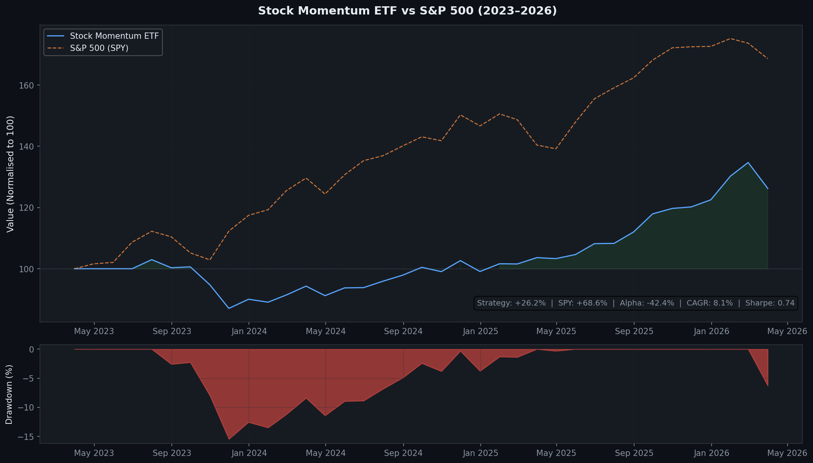
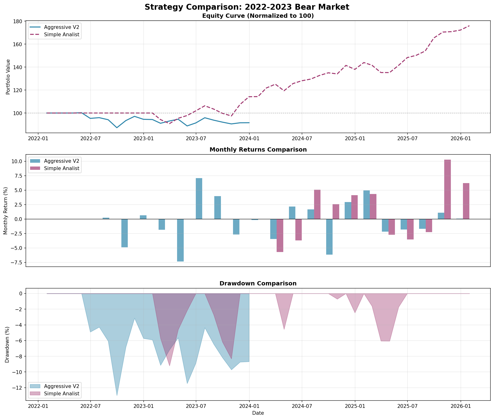

# Stock Momentum ETF

Monthly-rebalancing momentum strategy on ~157 liquid US ETFs. Holds the strongest trending ETFs, exits when momentum fades, and halves all positions during confirmed market downtrends.

## Performance


.png)


### Backtest Results (2023–2026)

| Metric | Value |
|--------|-------|
| Total Return | +26.2% |
| CAGR | 8.1% |
| Max Drawdown | −15.5% |
| Sharpe Ratio | 0.74 |
| Win Rate | 63.9% |
| Profit Factor | 1.77 |
| vs SPY | −42.4% alpha (SPY ran +68% in this period) |

### 9-Year Results — Aggressive V2 (2016–2025)

| Metric | Value |
|--------|-------|
| Total Return | +1,080% |
| CAGR | 28.3% |
| Sharpe Ratio | 1.35 |
| Max Drawdown | −20.9% |

> Recent period (2023–2026) was a broad bull run where passive SPY exposure dominated. The strategy has low beta (0.25) and outperforms in choppy or bear markets.

## How It Works

### 1. Universe (no survivorship bias)
Screened from 300+ US ETFs: price $5–$10k, volume ≥ 100k/day, 3+ years history. ~157 pass. Rebuilt fresh at each run.

### 2. Monthly Signal Scoring
```
momentum_score = (return_3m × 0.4) + (return_12m × 0.6)
trend_bonus    = +10 if close > MA200 else −10
final_score    = (momentum_score × 0.7) + (trend_bonus × 0.3)

BUY  if score ≥ 70 | HOLD if ≥ 50 | SELL if < 50
```

### 3. Position Sizing
Volatility-targeted to 15% annualised. Each position inversely sized to its own volatility, capped at 15% per position.

### 4. Regime Filter
When SPY < 200-day MA → cut all positions to 50%. Limits drawdowns in confirmed downtrends.

## Run
```bash
pip install -r requirements.txt
python universe_builder.py        # build ETF universe (run once)
python backtest.py                # standard backtest (2023–2026)
python backtest_aggressive_v2.py  # aggressive config — best 9-year results
python backtest_defensive_8yr.py  # bear-market variant
```
